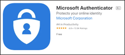
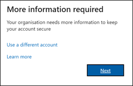
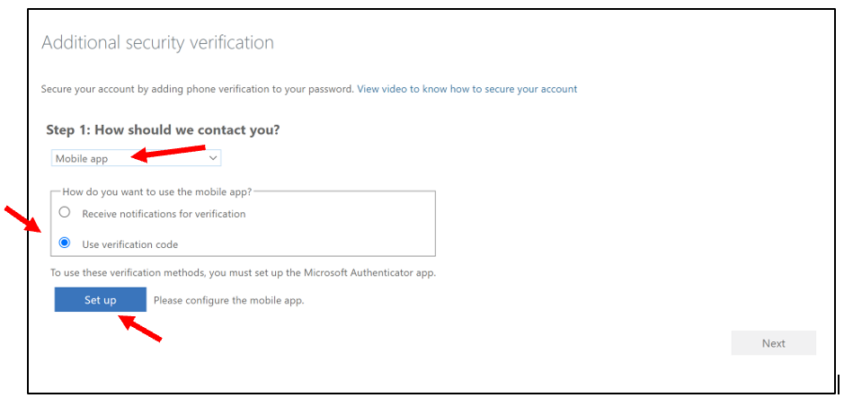
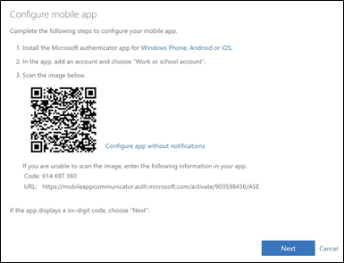
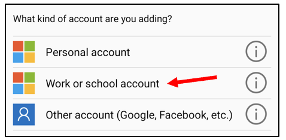
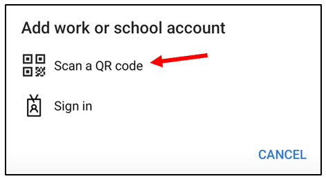
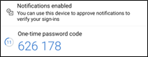
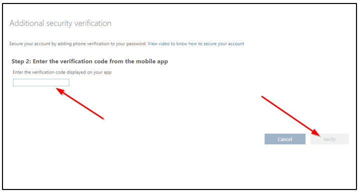

# Multi-Factor Authentication
## What is Multi-Factor Authentication?
Multi-factor authentication adds an additional layer of security to your online accounts. Verifying your identity using a second factor (like your phone or another mobile device) prevents anyone but you from logging in, even if they know your password.

## How do I register my account?

Follow the steps below, you can also view Microsoft’s instructional video at [https://youtu.be/Q8OzabuNwHI](https://youtu.be/Q8OzabuNwHI).  

1.	On your mobile device download the Microsoft Authenticator app (available in the app store on iOS or Google Play on Android).
  

2.	On your computer open a browser and navigate to [https://aka.ms/mfasetup](https://aka.ms/mfasetup).  
3.	You should see a **_'More information required'_** prompt.  
    

4.	Next, you will be asked how you should be contact to verify your password. Select **Mobile app** and check **Use Verification Code**. Then click **Set up**.  
  

5.	You will now be presented with a QR Code to use in the next steps.  
  

6. On your mobile device, open the Microsoft Authenticator app and click **‘+’** to add an Account and then select **Work or School account**.  
  

7. Select **Scan a QR code**.  
  
  
8.	Authorise the app to access your camera (if prompted).  
  
9.	Scan the QR code generated on your computer screen and then press **Next** once the code is scanned successfully.  
  

10.	Click **Next** again and you will be prompted to enter the verification code from the app.

11.	Type in the code from the app on your computer, click **Verify** and then follow the instructions on the screen.  
    
  

12.	Click **Done**.

13.	You will now be set up for MFA. Occasionally, you will be prompted to enter a new verification code when accessing your account.

## Frequently Asked Questions
### How often will I be asked for multi-factor authentication?
You **_may_** be prompted for your MFA code in the following circumstances as well as re-authenticating every 45 days.
* Switching to a new browser or Switching to a new device  
* Clearing browser cookies or using an incognito/private browser window
* Signing out of a Microsoft 365 application and signing back in  
* IT revoking MFA sessions if your device is lost or stolen
* Your MFA settings are cleared and require you to re-register with MFA
* Trying to sign in in an unfamiliar location (e.g., while on holidays in another state)

### Do I need to authenticate when I login to my laptop or computer or phone?
No, the authentication only applies to Microsoft 365 applications either installed on your devices including phone or when accessing via a web browser.

### What if I don’t have my mobile device when I need to login?
You will need your mobile to log in. Due to our security requirements, multi-factor authentication cannot be bypassed or turned-off for any reason. 

### What if I don’t want the authenticator application installed on my personal device?
You will not be able to access the Microsoft 365 applications on your mobile device and will not be able to access your work account at all.

### What if I am getting prompts on my mobile about MFA and I have no where to enter the code?
Contact IT immediately. Someone else may be trying to access your account.

### What if I lose my phone or if I get a new one?
You will need to set up MFA on the new device. MFA settings cannot be transferred to your new phone.

### Do I have to use the Microsoft Authenticator app?
Technically, no. However, if your account is transitioned from standard passwords and MFA across to a passwordless configuration, you will need the Microsoft Authenticator app. In this case, it may be simpler to use the Microsoft Authenticator app from the outset.
